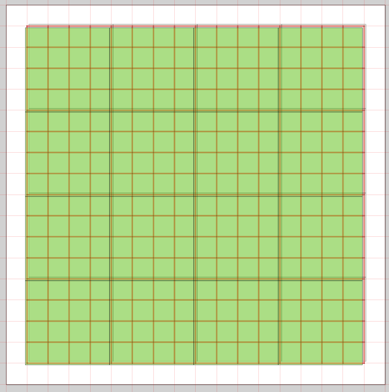
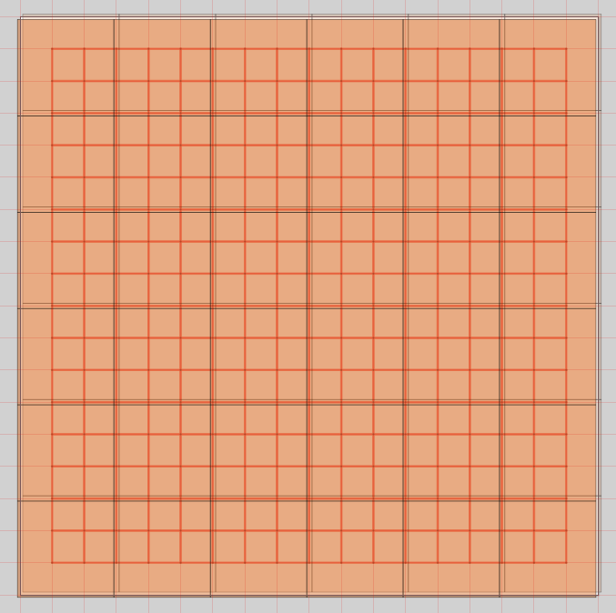

# Design options

## Tiling options

### 360mm Tiles and 720mm Panels
For any design based on the tiling of individual, identical sections there are going to be constraints. A practical lower limit on the size of a tile is 360mm x 360mm since any less than that does not actually enclose a single cell. Tiling with small unit takes more effort in assembly with 64 units needed for a full size maze. Panels of 720mm x 720mm size are more convenient. This size panel could be assembled from four 360mm tiles. They are manageable in small cars and only 16 are needed to make up a full maze. A disadvantege to this size is that it *exactly* covers the 16x16 cell contest maze. That means there is no border around the maze and special infil pieces are needed to support the outer walls adequately:

An individual builder might have four such panels - enough for a quarter maze. The panels could be arranged in several ways but a number of edge supporting strips would be required on all exposed edges.

### 540mm Tiles
Increasing the size of the tiless to 540mm x 540mm would mean that 36 tiles are needed to build a full maze although these dimensions are outside the capacity of typical home CNC machines like laser cutters. Tiles this size will fit even in small cars and should be small enough to fit on a car seat and would be small enough to fit within the floor footprint of something like a washing machine. The tiling of these larger pieces allows for a good border around the maze area and no special parts for the outer perimeter walls. The existing UK maze is effectively made up from panels of four 540mm tiles.

Individuals would need 9 of these tiles to make a quarter maze. Edge support strips would be needed to use the full potential area of 9 cells by 9 cells but would not be needed in a contest maze. There are more ways to arrange 9 of these intermediate size panels.

