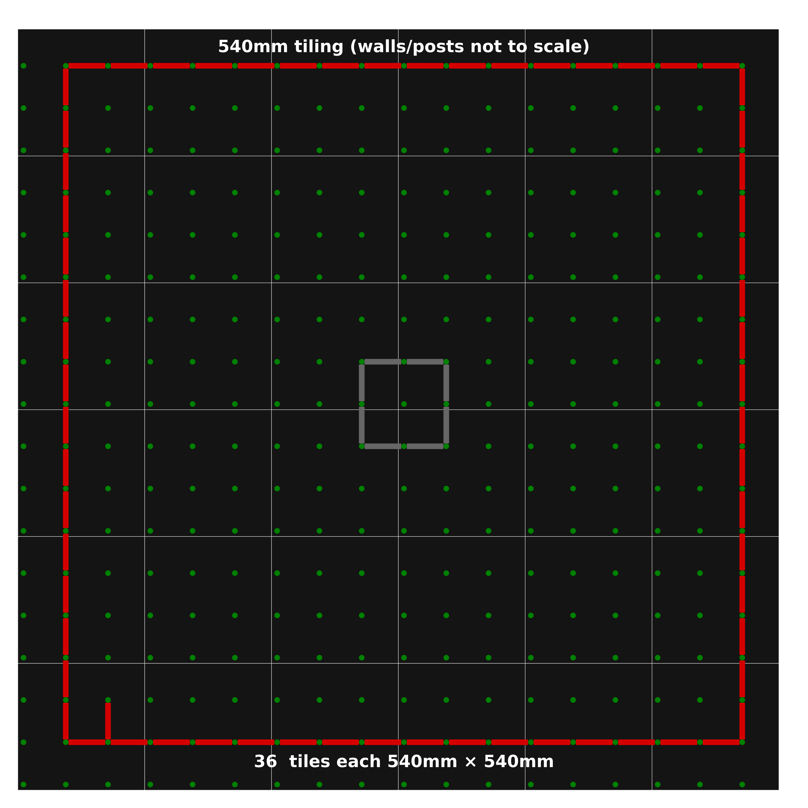

# Design outline

After a lot of deliberation, we settled on a maze constructed from 540mm tiles. Each tile is made from two layers with interlocking tabs to ensure better vertical alignment.

### 540mm Tiles
Increasing the size of the tiless to 540mm x 540mm would mean that 36 tiles are needed to build a full maze although these dimensions are outside the capacity of typical home CNC machines like laser cutters. Tiles this size will fit even in small cars and should be small enough to fit on a car seat and would be small enough to fit within the floor footprint of something like a washing machine. The tiling of these larger pieces allows for a good border around the maze area and no special parts for the outer perimeter walls. The existing UK maze is effectively made up from panels of four 540mm tiles.

The area available is larger than needed for a standard 16x16 maze. The additional space could be used to construct practice areas for sensor calibration.

## Layered Tiles

Regardless of the size of individual tiles they must be joined together somehow. The joins must keep the tiles located both horizontally and vertically with a high degree of accuracy. the published rules permit quite large gaps and steps. This is mostly to remind builders of the worst case. High performance mice are much more sensitive than their forebears from the 1980s and are only really able to shine on a high-quality maze. Thus, a contest maze should be as close to seamless and stepless as possible.

After some experimentation, the final design used in 2023 is a two-layer tabbed tile of 540mmx540mm. Rather than separate tabs, the bottom layer is machined from a single piece to create the interlocking tabs and voids. This view shows a set of four tiles assembled into a panel:

Each tile looks like this and is made of two separate layers aligned by the post holes then glued and pinned together.

There is a video showing how these are made and assembled:

https://www.youtube.com/watch?v=BzY3Bj1GRg4

## Manufacture

Individual  files showing the component design can be found in the [resources](./resources/) directory. There are images of each part and a PDF file with the dimensions. You will also find DXF and SVG files with the outlines and hole positons. Dimensions are in mm.

The raw material is 6mm MDF. We use self-coloured black MDF but you can use whatever is available and paint it to suit. It is easier to pre-paint the top layer before cutting to avoid having to clean up the holes and edges afterwards.

Holes are nominally 6.1mm and can be adjusted to suit your particular posts.

Cutting the top layer should be done such that it is about 0.25mm undersize to allow for small innaccuracies in the alignment while not creating an excessive gap.

## Edges

In an assembled maze, there will be a row of post holes along two edges that are slightly difficult to use. To make that easier, I have pieces made from two layers of 3mm MDF, cut on a lser. They join together to make a strip like this:

And they can be placed around the edge like this:

