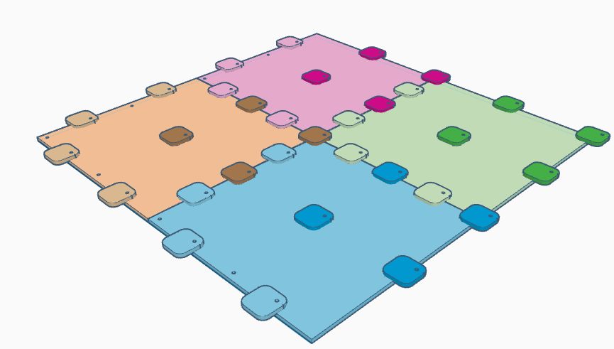

# Single Layer Tiles with Supports and Tabs

### (5) 360mm or 540mm square tiles, one layer with tabs

(seen from the underside)

Each tile would comprise a single layer of material with tabs used to support and join the layers. The
design is suited to either 360mm or 540mm square tiles with the different sizes carrying the same pros and cons listed above.

The illustration is for a 360mm tile made up into a 720mm panel. (540mm tiles would not require assembly into larger panels). These notes represent an example of construction only. For this size, eight identical tabs, each 48mm square, would be used on each tile. Four of these (darker in the brown tile) align with the post holes. The other four (lighter on the brown tile) can be aligned on the opposite edge midway between the hole locations. This need not be exact but note that the tab size has been chosen so that tiles/panels should slide in at 45 degrees without interference. Overlap at the edge is 24mm in each case. All tabs in the illustration have a hole just because it was easier to replicate the same shape than make two different ones.

On any given edge, the alternating tabs from the two adjacemt tiles ensure vertical aligment and the post pegs ensure that the adjacent tiles are held together horizontally.

The tabs and running surface need not have the same thickness and no shimming is required. The fastest, cheapest and lightest option would use 6mm material for both the main tile and the tabs. This can be cut fairly quickly on a diode laser and the tabs can be cut from what would otherwise be waste in a 400mm square blank. In this way, 18 complete tiles (2.33m²) could be made from a single sheet of 6mm raw material for a cost of under £2 per tile or about £100 for a complete maze.

Testing would be needed to ensure that 6mm material is strong enough for the upper layer. The maximum between tabs would be under 180mm but the underside may not always be fully supported if, for example, tables were used as supports. Mouse owners and organisers will inevitably need to lean or kneel on the maze and it must be durable. Increasing the thickness of the top layer to 9mm or 12mm may be needed and that might double the cost and the cutting times. Experiments must be performed.

If 6mm is sufficient, then it may still be necessary to consider a simple, loos layer of 6mm material to accomodate any gaps in the support structure.

The voids between tabs would be useful for running cables for timing gear. Tabs could be modified to allow a small cable channel without unduly affecting the support needed by the posts.

To attach the tabs accurately, an assembly jig would be needed. Attachment is probably easiest, for 6mm thick tabs, if wood glue provides the adhesion and 10mm staples from a cheap staple gun hold them in place. The tabs may beed a covering of felt to prevent any damage caused by sliding them over another tile or other surface.

The post hole grid is set in with the hole centres starting 12mm from the edges. The overlap would thus be 24mm wide.

#### Advantages:

- By far the option that is lightest, cheapest and easiest to make
- Allows for cabling of timing gates.
- Vertical alignment should be reliable

#### Disadvantages

- With only one thin upper layer strength and stiffness may be a problem
- Tabs may be susceptible to damage
- An underlying support may be required
- Assembly of the maze might be fiddly due to the interlocking tabs
- For 360mm based patterns, the support strips for the outer wall of a conest maze would still be needed