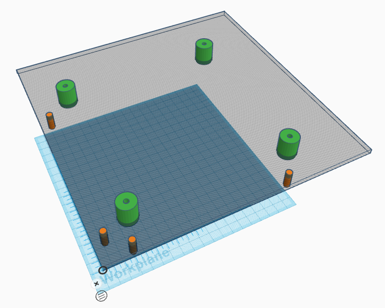

# Construction

One of the project aims is to democratise manufacture. Not everyone would have the tools and/or skills needed to make a maze or maze components. Even so, we hope to make the overall construction options as wide as possible so that fully compatible maze parts are possible and distributed as widely as possible.

## Manufacture constraints

- Tile pieces must be cut accurately and square with minimal surface damage from tear-out.
- Edges should not be sharp but also not overly rounded to that joints are snug and fit without appreciable gaps.
- Allowance must be made for small variations in material thickness and dimensional changes due to differing storage environments
- Surface finish should be mandated using a widely available paint finish and method of application or by such other means as are available.

### Other considerations

With the relative popularity of CNC laser engraver/cutters and CNC routing machines, there are advantages in considering their use in the manufacture of maze tiles. Accuracy and repeatability are generally beyond doubt. However, thare are a couple of constraints surrounding their use.

- Not everyone has access so it it might be best to plan around the possibility of manufacture with other tools to avoid the burden falling on a small number of individuals.
- Even where such machines are available, they are likely to be limited in their working envelope. That can be made large enough but only at additional cost or by taking up large amounts of workshop space. In an ideal world, there would be ready access to machines with a working envelop of at least 600mm square or even 1000mm square. These currently can cost £2,500 or more so that is not likely to be a very viable option.
- Laser engravers are reasonably priced and widely available. However, diode lasers will take a relatively long time to cut out the parts needed and are constrained to a 400mm x 400mm working area. CO2 lasers are much faster but unlikely to be able to cut anything larger than 400mm x 600mm. Hobby class CO2 lasers are too restricted in working area to be very useful

#### Drilling Jig

To make it possible for people without access to CNC machines to make a maze, we have also considered the development of a drilling jig. The idea is that a builder would only need to be able to accurately cut squares of base material and then use a jig to drill the post holes with a cheap hand drill. Such a jig could be made by those who do have access to precision machinery and then distributed to anyone who needed it. A small number of jigs would serve the needs of many and could even turn out to be the best method overall. Alignment pins locate the jig and hardened bushes make it easy to drill accurate post holes. Perhaps something like this intended for drilling holes on a 360×360 tile (A similar 9-hole jig would be used for 540×540 tiles):

