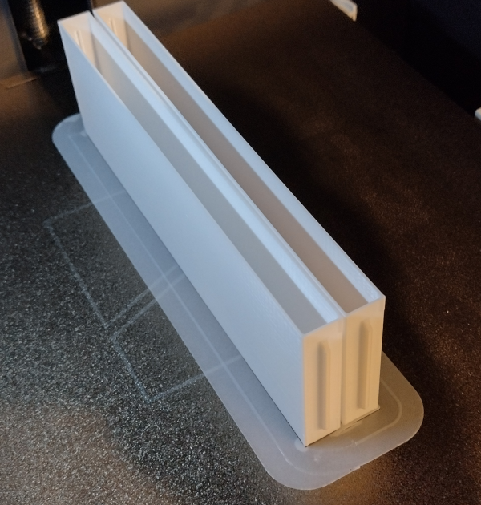

# Maze Walls and posts

## Walls

Although walls can be 3D printed, the UKMARS contest walls are all made from MDF. Suitable blanks are constructed and then covered with self-adhesive vinyl. The red top is created by adding red masking tape. These materials adhere well enough for contest use and provide a uniform and repeatable surface for sensor calibration.

Each wall has tabs at either end to locate in slots in the posts. The tabs are symmetric to makee it easy to insert a wall either way up. With a different bottom surface, walls can easily be inverted to mark off special sections or temporary walls. This is particularly useful when creating a wall-follower maze that is then converted to a normal maze-solver version.

It is possible to make 3D printed walls with an FDM printer. Simply printing the STL file however will be pretty slow. A better solution is modify the slicer settings to use only two outer wall loops, 3 or 4 bottom layers, no top layers and no infill. You can use a relatively large layer height of 0.24mm or more. This creates a hollow wall that can be filled with two pieces of 5mm foamboard for a lightweight and strong wall. The wall should be covered with white self-adhesive vinyl in the same way that the MDF walls are. It may be necessary to add glue to the inside of the walls to prevent them from bowing out around the foamboard filler.

If you have a fancy multi-filament printer, you can even print the bottom two layers with a red filament.

In the [walls-and-posts](walls-and-posts) folder, there is a .3mf file showing how to set upi the slicing.

Note that the walls are a little under the 168mm available between posts. That should ensure some tolerance in manufature. If you make walls, be sure they are no longer than 168mm or there will be problems with the fit.

For a full contest maze there will be a need for some 300 each posts and walls.

The covering material is Ri-Mark Event M300 Matt White Vinyl and is available from many sources. A 5M x 310mm roll would cost about £10 and is enough for about 60 walls.

## Resources
Drawings, descriptions and STL files are available in the [walls-and-posts](walls-and-posts) folder.

## Posts

Maze posts must have slots that provide an easy sliding fit for the tabs on the ends of the walls. The design files here show a post that is 11.5mm square - slightly less than the nominal 12mm square. Like the walls, this provides for some small variation in manufacture ad maze hole positioning. These are quite tight tolerances. If you make yuour own posts, run tests until you are sure you have the sizing correct. It is common for exposure times to affect the finished dimensions of resin prints and the slicer settings will affect the finished size of FDM prints. 

The peg that locates the post, and aligns the maze base parts is nominally 6mm diameter and long enough to fit through two 6mm layers. the peg is shown at less than 6mm in the notes and drawing because misalignment of FDM printed parts will inevitably make the peg seem too tight. Some filing or sanding may be needed to get a good fit. No real harm is done if the posts are a little loose but you will soon tire of having the post pull out whenever you remove a wall.

Posts are relatively hard to make without a 3D printer of some kind. Resin printers are fast (perhaps 30 posts in 2 hours) but the material is brittle. FDM printers are slow (perhaps 8 posts in 4 hours) but the result is much tougher.

There are two post designs in [walls-and-posts](walls-and-posts)

### Resin printing
For resin printed posts the design incorporates a slightly shorter post with a hole through the centre to accept a 25mmx2mm nail. Nails are glued in to the hole and provide significant reinforcement. Even if a post breaks in the maze, it will be easy to extract the stub. The nails are cheap and readily available. Use an ABS-like white resin. It probably does not matter too much which brand and reflectifity of the posts is not normally a great problem.

### FDM printing
Attemmpting to print the post with an FDM printer as a single piece is doomed. The layers are not strongly bonded and you will get a weak post. The design here prints each post in two halves that are simply glued together to make a full post. Simple superglue is fine but arguably the best choice is the kind og glue sold as 'mitre adhesive' It is quite thick and has a very low odour. Normally it is supplied with a can of accelerant. You can appluy the glue to one half and accelerant to the other. Take care as the accelerant makes it set up almost immediately. I find it better to spray a bit of accelerant on a cloth then wipe the non-glued post half on that to transfer just enough to speed up the setting. The best choice of filament is probably white PETG for toughness and no fumes. However, PLA is cheaper and faster to print. Filament pigmentation can vary greatly. I just use cheap white Geeetech PLA. Many others will work just fine.

