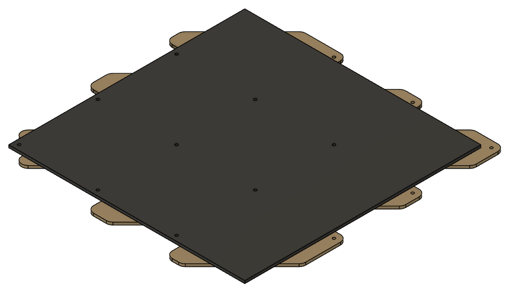
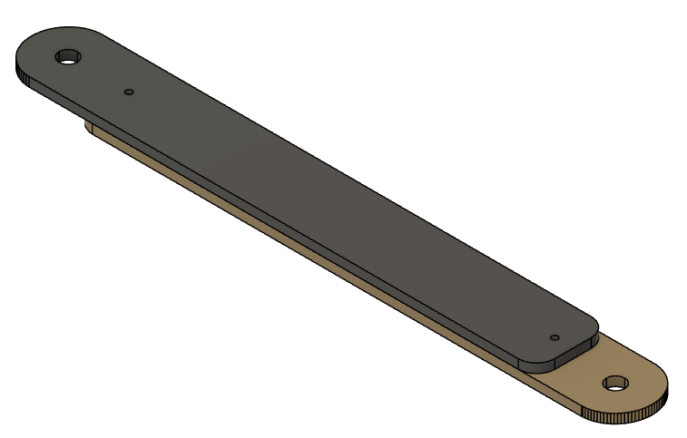

# Final Design 2023

After some experimentation, the final design used in 2023 is a two-layer tabbed tile of 540mmx540mm. Tather than separate tabs, the bottom layer is machined from a single piece to create the interlocking tabs and voids. This view shows a set of four tiles assembled into a panel:

Each tile lookslike this and is made of two separate layers aligned by the post holes then glued and pinned together.

There is a video showing how these are made and assembled:

https://www.youtube.com/watch?v=BzY3Bj1GRg4

## Manufacture

Individual  files showing the component design can be found in the resources directory. There are images of each part and a PDF file with the dimensions. You will also find DXF and SVG files with the outlines and hole positons. Dimensions are in mm.

The raw material is 6mm MDF. We use self-coloured black MDF but you can use whatever is available and paint it to suit. It is easier to pre-paint the top layer before cutting to avoid having to clean up the holes and edges afterwards.

Holes are 6.1mm and can be adjusted to suit your particular posts.

Cutting the top layer should be done such that it is about 0.25mm undersize to allow for small innaccuracies in the alignment while not creating an excessive gap.

## Edges

In an assembled maze, there will be a row of post holes along two edges that are slightly difficult to use. To make that easier, I have pieces made from two layers of 3mm MDF, cut on a lser. They join together to make a strip like this:

And they can be placed around the edge like this:

