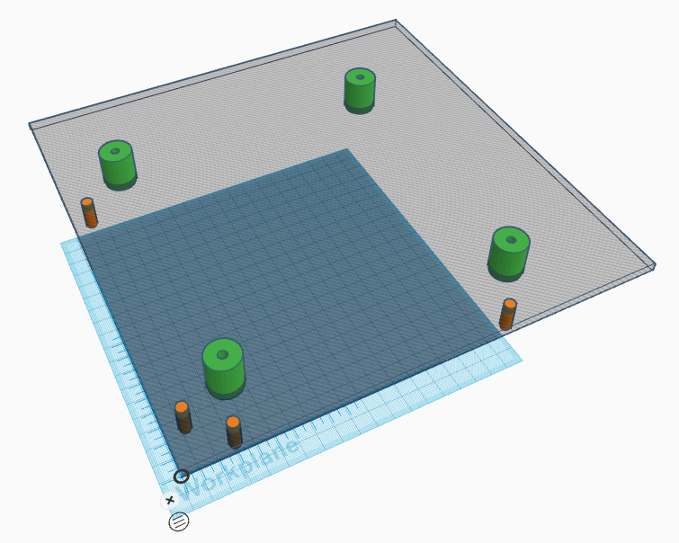

# Drilling Jigs

If there is no access to a CNC macine such as a router or a laser cutter, then the post holes will have to be made by hand. For home use this is perfectly possible by careful measurement on individual tiles. If the tiles must join arbitrarily with other tiles then steps must be taken to make the hole location more accurate.

A drilling jig has two functions. One is to accurately locate the holes with respect to two reference edges on a tilepiece and the other is to ensure that the holes are drilled perpendicular to the surface. Ideally, these two functions will be incorporated into a single jig but it is possible to create one jig to locate the holes and another to drill them.

### Drill bushes
Steel bushes or drill guides are readily available and these should be hardened if more than a few holes will be needed. These bushes are typically cylindrical with a bore just large enough to pass the drill bit through. Since the outer diameter may be only 20mm or so, they will need some additional support to help keep them perpendicular to the workpiece. 

If the bushes are to be used only for marking the hole positions they need only be positioned accurately on the jig. A pointed steel shaft that is a close fit in the bush can be used as a centre punch. Be sure that the point of the punch really is concentric with the shaft. 

### Bush Support for Drilling
A hefty hand-drill can easily exert quite a large force that will tend to tip a drill bush over. Longer bushes give greater accuracy but also more leverage. For consistent results the bushes can be mounted in thicker material but this can be ungainly in use. A better solution might be to provide local support for a wider base. A 3D-printed support collar is an easy solution.

### Edge Locating Guides
Locating the holes from the reference edges can be done with pins or guides on the jig. Guide pins should be substatial and a good choice would be steel pins the same diameter as the post holes so that they can also be used as gauges or for alignment of maze pieces during manufacture.

Just three pins are sufficient to accurately determine the location of the jig. Two pins touch against one edge and one agains hte other. The two pins on the same side should be as far apart as possible for the best accuracy. It is most convenient and flexible to allow for two pins on each edge.

While it is possible to use strips of material attached to the jig to locate the edges this is likely to be less accurate and more error-prone. Such strips easily trap debris such as sawdust and will then no longer seat accurately against the tile stock. This may not be apparent until the holes are later found not to line up correctly with adjacent tiles. I fusing strips take extra care to ensure they are clean and leave a gap at the corner where there is the greatest risk of debris collecting.

### Accuracy
Accuracy and repeatability are key to the use of a drill jig. That will be a combination of an accuratly constructed jig and good drilling technique. While it is possible to make a jig by hand to arbitrary accuracy standards, it is much easier if the jig is at least laid out and cut using CNC machines. A CNC router or laser with a working area of 400mm×400mm will be needed. Fortunately, that is just within the capabilities of common diode laser engravers.

## TODO
- Drawings for a 4-hole and 9-hole jig
- assembly instructions for same

### Example
An example of a possible arrangement for a four-hole drilling jig looks like this:

