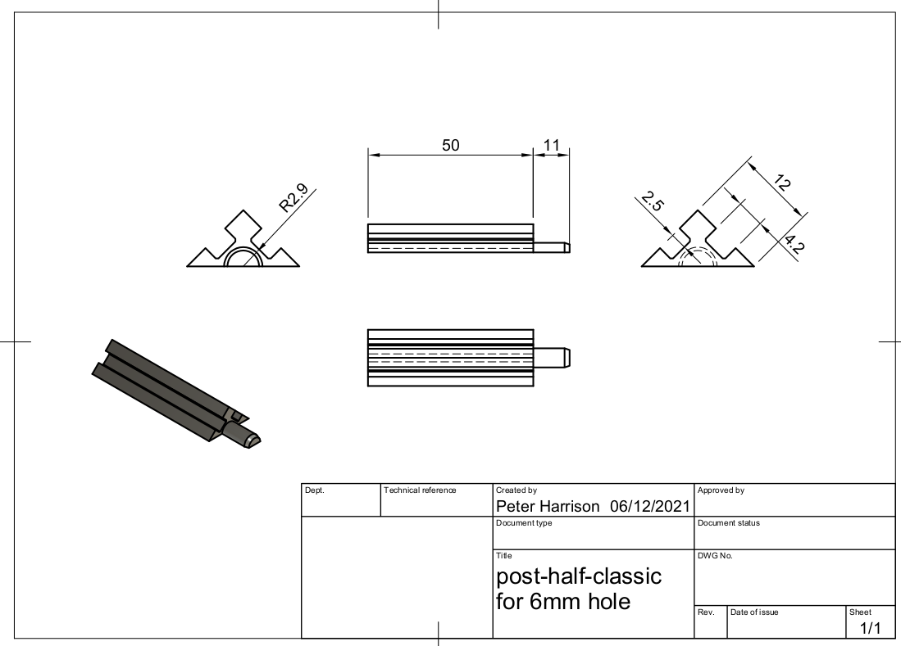

# Posts and Walls

## Classic Micromouse

### Walls

The micromouse classic walls are 12mm thick and 50mm high. The surface is described as white but no detils are specified for reflectivity or shininess. Typical contest walls are injection moulded from an unspecified plastic and are reflective to both visible and IR light. Form many (most) micromouse sensor designs it is the IR behaviour that is the most critical while also the least easy to observe. The shininess of the surface plays a big part in the response of the sensors. Matt finish walls are not typical in contest mazes and neither are very shiny reflective walls. A reasonable compromise is silk or eggshell finish paint, white melamine laminate or self adhesive semi-gloss finish vinyle sign-making material.

The tops of the walls and posts have historically been painted red. This is likely to be mostly for visual contrast. The only requirement is that the top of the wall be reflective to visible and IR light and provide good contrast with the maze floor. White wall and post tops are likely to be acceptable unless a mouse enters that uses a vision system that epects to have a visible light contrast with the wall surface or which expects to be able to extract the colour information to detect the wall tops.

### Posts

The posts are 12mm square cross section and 50mm high. Like the walls, they are white and tradidionally have a red top. The light reflecting properties should ideally match those of the walls but some variation is to be expected.

Posts are normally located in the maze floor by means of a circular peg or spigot inserted in a suitably sized hole in the floor. Contest mazes around the world vary greatly in the choice of hole size so do not expect posts to fit without checking. In the UK, we now use a nominal peg diameter of 6mm and the hole should be a close sliding fit for that size peg. Normally, this can be achieved with a 6.1mm drill it.

Note that ordinary twist drills used in soft materials are likely to drill slightly undersize so a 6mm drill bit may produce a hole that is a bit of a tight fit. Machine milling with a 6mm endmill may produce a hole of the correct size. A laser cutter with a 0.1mm kerf may, or may not, need a slight offset to get an appropriate sized hole. If the laser is set to cut exactly 6mm then the resulting hole may be wider by the laser kerf.

### Wall to Post Attachment

Typicaly the posts are slotted on all four sides to accept projecting tabs on the walls so that the walls can be easily slid into place or removed from above. the arrangement needs to positively locate a wall without binding while also being tolerant of slight misalignment of the post holes. Thus, the wall length will be less than the nominal 168mm between posts by an amount that can accomodate post misalignment. For example, if all posts could be guaranteed to me no more than 0.5mm out of place, a siutable maumum wall length might be 166.5mm to allow 0.5mm either end for the posts and an extra 0.5mm to ensure an easy fit. 

The tab and slot mechanism should allow an easy sliding fit with the slots being as deep as can reasonably be managed and the tabs slightly smaller. If the slots are too deep, the post will be weakened and if they are too wide, there may not be enough material left to survive impact from a wayward robot. Again, the specifics vary from country to country. 

In the UK, the posts are likely to be 3D printed with the dimensions shown in the drawing below.
***Note that the peg size is shown as 5.8mm. This is actually a nominal 6mm but depends how your slicer is set up***

